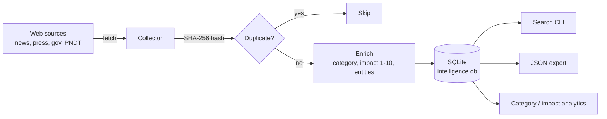

# Intelligence Monitor — Gabon 🇬🇦

<p align="center">
  
  
  
  
  
</p>

> **Agent de veille automatisee** qui scanne plusieurs sources web, dedoublonne via hash SHA-256, score l'impact de chaque entree et stocke tout dans une base SQLite requetable. Pense et construit au Gabon pour des decideurs qui veulent de la donnee exploitable, pas du bruit.

## Why this repo exists

Les equipes strategiques en Afrique centrale perdent des heures a lire des dizaines de sources pour reperer 2 ou 3 signaux vraiment utiles. Ce projet automatise la collecte, la deduplication et la priorisation pour que l'utilisateur ne voie que ce qui compte.

## Architecture



## Secteurs suivis

| Secteur | Perimetre |
|---|---|
| **Transport (Gabon)** | Infrastructures, rail, ports, aeroports |
| **Transport (Afrique)** | Corridors regionaux, connectivite |
| **PNDT** | Plan National de Developpement pour la Transition |
| **Mines (Gabon)** | Projets miniers, concessions, operateurs |

## Features

- ✅ **Monitoring multi-sources** — collecte automatisee
- ✅ **Deduplication** — hash SHA-256 sur le contenu
- ✅ **SQLite indexe** — requetes rapides sans serveur
- ✅ **Recherche par mots-cles** — titres, resumes, entites
- ✅ **Export JSON** — donnees structurees pretes a integrer
- ✅ **Analyse par categorie** — repartition sectorielle
- ✅ **Scoring d'impact 1-10** — priorisation
- ✅ **Audit trail complet** — timestamps et attribution des sources

## Screenshots

> _Placeholder — ajoutez ici une capture du CLI ou d'un tableau de resultats pour illustrer le produit._
>
> 

## Quickstart

```bash
# 1. Clone
git clone https://github.com/justoconnect/intelligence-monitor.git
cd intelligence-monitor

# 2. Run — zero external dependencies, Python stdlib only
python3 intelligence_monitor.py

# 3. Try the example
python3 examples/basic_usage.py
```

Requires **Python 3.9+**.

## Tech stack

| Layer | Choice | Why |
|---|---|---|
| Language | Python 3.9+ (stdlib) | Portable, no install friction |
| Storage | SQLite | Zero-ops, file-based, indexable |
| Hashing | `hashlib.sha256` | Deterministic dedup |
| Export | JSON | Easy downstream integration |
| CI | GitHub Actions | Lint + tests on every push |

## Who this is for

- **Cabinets de conseil** qui livrent des notes sectorielles Afrique.
- **ONG et bailleurs** qui suivent des programmes (PNDT, infra, mines).
- **Fonds d'investissement** avec theses Afrique centrale.
- **Equipes publiques** qui veulent structurer leur veille.
- **Journalistes** qui traquent des projets sur la duree.

## Author

**Kpakpo Justin Akue** — AI, Data & Automation Consultant, Libreville (Gabon).

- LinkedIn : <https://www.linkedin.com/in/kpakpo-justin-akue-904a5010>
- GitHub : <https://github.com/justoconnect>

## Hire me for consulting

Besoin d'une veille sectorielle sur mesure, d'un pipeline de donnees, ou d'un agent IA pour votre equipe ? Je livre des projets courts (2 a 6 semaines) avec code, documentation et handover.

**Specialites :** agents IA, pipelines de donnees, automatisation LinkedIn / CRM, integrations API (Perplexity, OpenAI).

**Contact :** LinkedIn ou via GitHub issues — reponse sous 24 h.

## Contributing

See [CONTRIBUTING.md](CONTRIBUTING.md). Issues and PRs welcome.

## Changelog

See [CHANGELOG.md](CHANGELOG.md).

## License

MIT — see [LICENSE](LICENSE).

---
<p align="center"><em>Made in Libreville &mdash; Gabon 🇬🇦</em></p>
